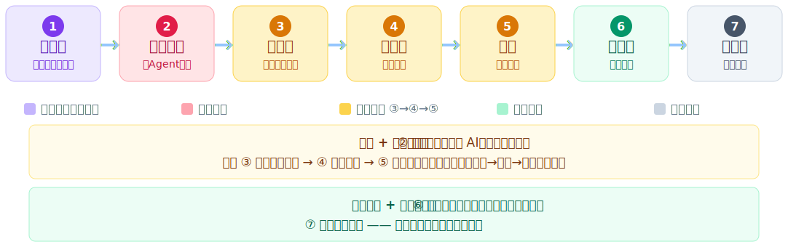
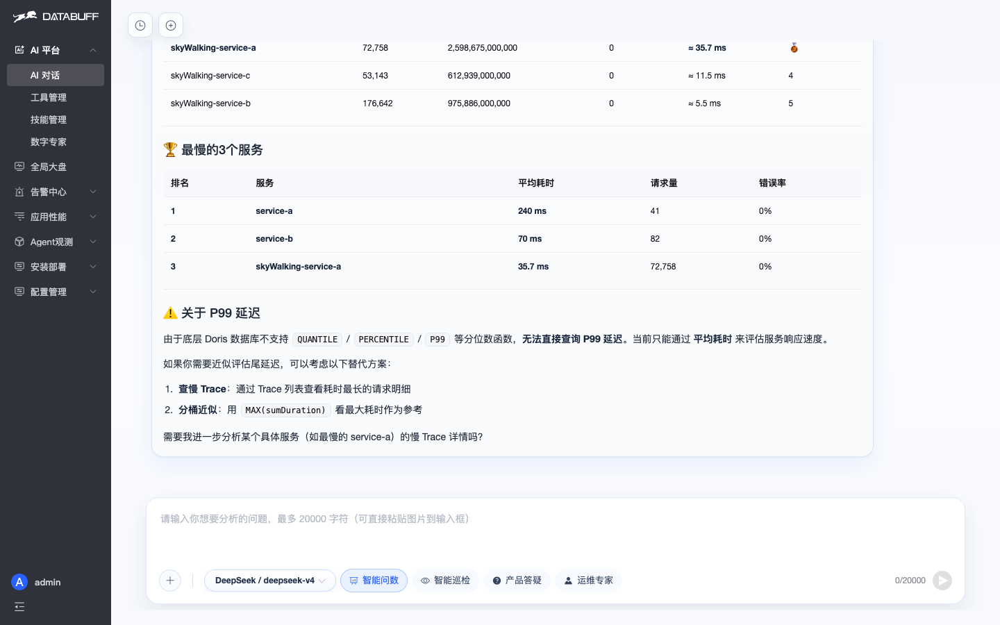
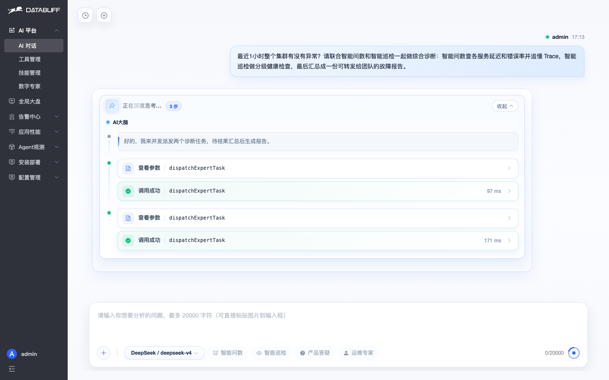
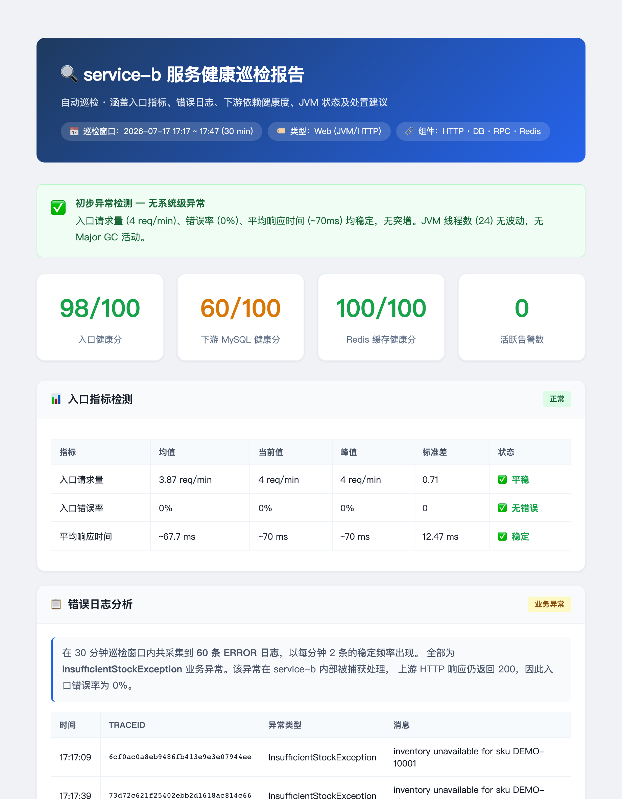
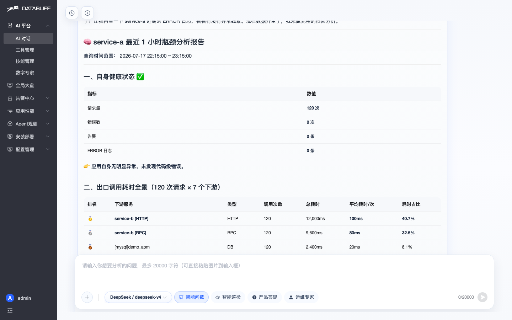
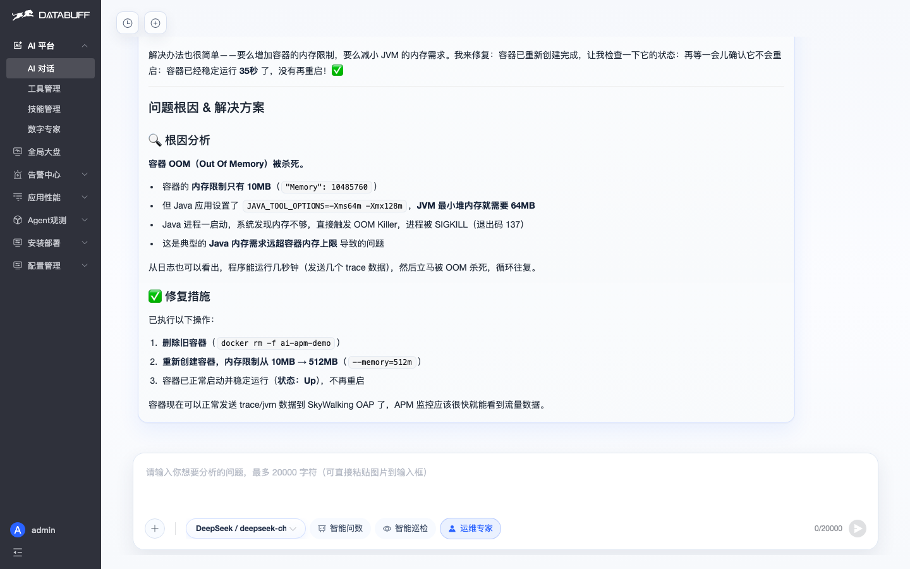
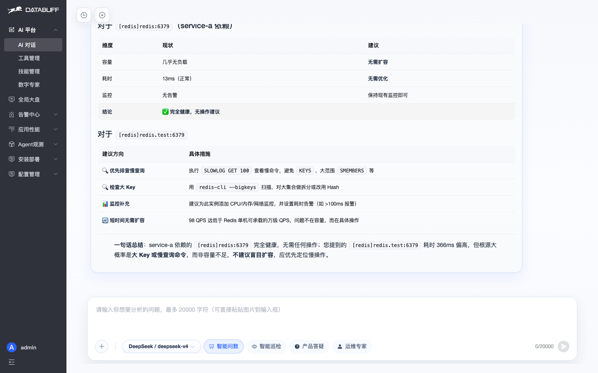
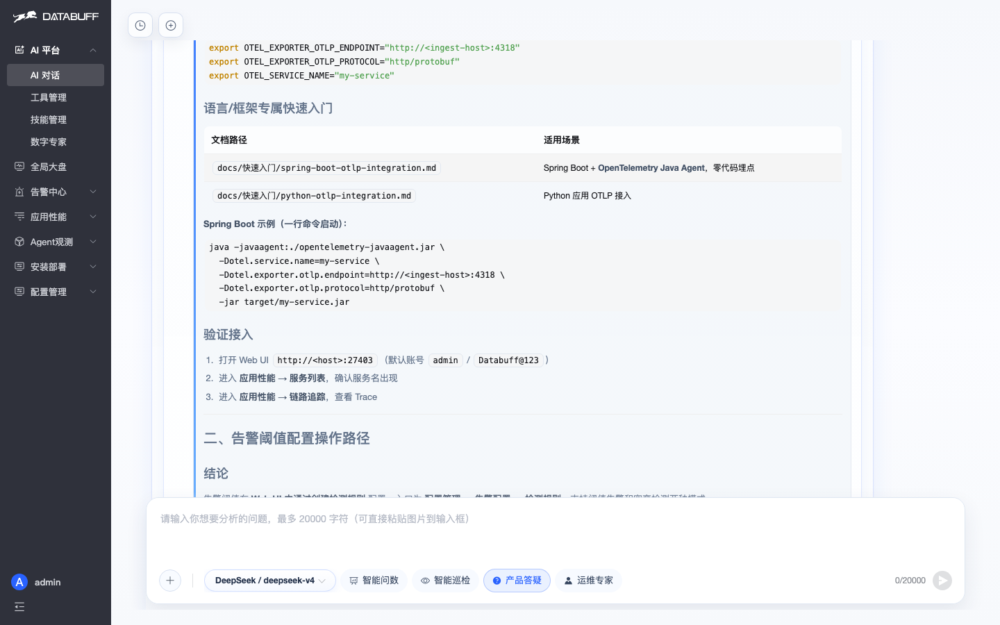

<div align="center">

<p align="center">
  
  &nbsp;&nbsp;
  
</p>

<h3>AI Native OpenTelemetry APM</h3>

<p align="center">
  <a href="https://demo.databuff.ai">在线演示</a>
  &nbsp;|&nbsp;
  <a href="docs/README.md">文档</a>
  &nbsp;|&nbsp;
  <a href="README_en.md">English</a>
  &nbsp;|&nbsp;
  <a href="#交流群">交流群</a>
</p>

<p align="center">
  在线演示 Demo，需要加入下方交流群获取账号密码
</p>

</div>

<br/>

<p align="center">
  
</p>

<br/>

---
DataBuff 是一款面向 AI 智能体、微服务、云原生场景的 **AI 原生开源 APM 软件**，以 OpenTelemetry 标准接入，提供**全链路监控**、服务拓扑、RED 指标、智能体监控与 AI 工作台。

## 功能特性

- 🤖 **AI 原生，不是外挂聊天框** — LLM 直接查询 Trace、指标、拓扑、告警，回答基于真实数据
- 🧠 **多智能体协同** — AI 大脑统一编排，智能问数 / 巡检 / 运维 / 答疑专家各司其职，复杂问题并行协作
- 🎯 **AI 应用监控**（Roadmap）— LLM 调用链 · Token 分析 · Agent 拓扑 · 技能/工具/模型调用追踪
- ⚡ **eBPF APM**（Roadmap）— 内核级无侵入采集，零修改代码获取调用链与性能数据
- 📊 **双协议 APM 底座** — OTLP 标准接入 + **SkyWalking 原生 gRPC 兼容**，老 SkyWalking 用户改个 exporter 地址即可切换
- 🚨 **告警闭环** — 阈值与突变检测、定时评估、告警事件记录
- 🔧 **Skill + Tool 可扩展** — 内置 Skill 可覆盖，支持自定义数字专家，无需改核心代码
- 🔌 **MCP 双向开放** — 平台暴露 MCP 供 Cursor / Claude 等调用；也可接入外部 MCP（Prometheus 等）
- 🐳 **极简三组件架构** — Ingest + Doris + Web，Docker / K8s 一条命令跑起来
- 🌐 **自带模型** — OpenAI 兼容 + Anthropic；支持 Kimi、DeepSeek、GLM、Ollama 等
---

<h2 align="center" id="aiops-路线图">AIOps 路线图：看得见 → 军团协同 → 会巡检 → 会诊断 → 会修 → 会预测 → 会答疑</h2>

<p align="center">先看一眼路线图，再逐个展开。整条弧线是 AIOps 从「能看」走到「能动手」再到「会陪伴」的完整闭环。</p>

<p align="center"></p>

<table align="center" cellpadding="0" cellspacing="0" style="border:none;border-collapse:separate;border-spacing:6px;margin-top:8px;">
<tr>
<td align="center" style="border:none;background:transparent;font-size:11px;color:#64748b;padding:2px 8px;"><span style="display:inline-block;width:10px;height:10px;background:#c4b5fd;border-radius:3px;vertical-align:middle;"></span>&nbsp;开场（最低门槛）</td>
<td align="center" style="border:none;background:transparent;font-size:11px;color:#64748b;padding:2px 8px;"><span style="display:inline-block;width:10px;height:10px;background:#fda4af;border-radius:3px;vertical-align:middle;"></span>&nbsp;军团协同</td>
<td align="center" style="border:none;background:transparent;font-size:11px;color:#64748b;padding:2px 8px;"><span style="display:inline-block;width:10px;height:10px;background:#fcd34d;border-radius:3px;vertical-align:middle;"></span>&nbsp;故障闭环 ③→④→⑤</td>
<td align="center" style="border:none;background:transparent;font-size:11px;color:#64748b;padding:2px 8px;"><span style="display:inline-block;width:10px;height:10px;background:#a7f3d0;border-radius:3px;vertical-align:middle;"></span>&nbsp;事前预测</td>
<td align="center" style="border:none;background:transparent;font-size:11px;color:#64748b;padding:2px 8px;"><span style="display:inline-block;width:10px;height:10px;background:#cbd5e1;border-radius:3px;vertical-align:middle;"></span>&nbsp;陪伴收尾</td>
</tr>
</table>

<table align="center" cellpadding="0" cellspacing="0" style="border:none;border-collapse:separate;border-spacing:0;max-width:760px;margin-top:14px;">
<tr><td style="background:#fffbeb;border:1px solid #fde68a;border-radius:8px;padding:12px 16px;font-size:13px;color:#78350f;line-height:1.7;">
<b>军团 + 故障闭环：</b>② 点明它不是单个 AI，是一支军团；接着 ③ 巡检发现异常 → ④ 根因定位 → ⑤ 运维专家修复，是一条「发现→诊断→修复」链路。
</td></tr>
<tr><td style="background:#ecfdf5;border:1px solid #a7f3d0;border-radius:8px;padding:12px 16px;font-size:13px;color:#065f46;line-height:1.7;margin-top:8px;">
<b>事前预测 + 陪伴收尾：</b>⑥ 从「事后排障」走向「事前预判」；⑦ 答疑专家兜底——功能强，用起来还有人答。
</td></tr>
</table>

---

<h2 align="center" id="七个能力展开">7 个能力展开</h2>

<p align="center"><strong>① 看得见 · 自然语言问系统</strong></p>
<p align="center">大白话问「最近 1 小时哪个服务最慢」，AI 自己查 20 个服务、给出最慢 3 个排行与平均耗时，一行查询语言都不用写。</p>
<p align="center">
  
</p>

<p align="center"><strong>② 军团协同 · 多 Agent 并发派发</strong></p>
<p align="center">不选具体专家，把复杂任务丢给 AI 大脑——它按真实专家列表并发派给智能问数 + 智能巡检，分头查证后汇总成可转发的故障报告。</p>
<p align="center">
  
</p>

---

<p align="center"><strong>③ 会巡检 · 服务巡检 + HTML 报告</strong></p>
<p align="center">一句话触发单服务巡检，81 秒后生成排版完整的 HTML 报告：入口健康分 98、下游 MySQL 60、Redis 100、活跃告警 0——入口看似一切正常，错误日志区却摊开 30 分钟 60 条 <code>InsufficientStockException</code> 被 HTTP 200 盖住的「假正常」。报告可直接预览转发。</p>
<p align="center">
  
</p>

<p align="center"><strong>④ 会诊断 · 根因分析带证据链</strong></p>
<p align="center">问「service-a 瓶颈在应用、数据库还是下游」，AI 拉拓扑、排出口调用指标，按占比归因——瓶颈在下游 service-b 占 73.2%，其余环节不背锅，结论可直接写进故障报告。</p>
<p align="center">
  
</p>

<p align="center"><strong>⑤ 会修 · 运维专家 SSH 上机动手</strong></p>
<p align="center">不止看图，还能登机器帮你修。容器一直重启，运维专家 SSH 上机敲 docker logs / inspect / free -m，定位 OOM 137——容器内存限制只有 10MB 而 JVM 要 64MB，删旧容器、重建为 512MB、docker ps 恢复稳定。从「能看」走到「能修」的分水岭。</p>
<p align="center">
  
</p>

---

<p align="center"><strong>⑥ 会预测 · 容量健康度分析</strong></p>
<p align="center">从「事后排障」走向「事前预判」。AI 厘清真实依赖关系，对高耗时 Redis 做容量判断——98 QPS 远低于单机万级承载力，瓶颈不在容量而在大 Key / 慢查询，明确建议不要盲目扩容。</p>
<p align="center">
  
</p>

<p align="center"><strong>⑦ 会答疑 · 开源产品自带客服</strong></p>
<p align="center">「OTel SDK 怎么接入？告警阈值在哪配？」答疑专家真去翻产品文档，给出 OTLP 端口（gRPC 4317 / HTTP 4318）、Spring Boot Java Agent 一行命令零代码埋点、告警配置菜单路径——读的是自家文档，比搜索引擎靠谱。</p>
<p align="center">
  
</p>

---

<h2 align="center" id="数据接入">数据接入：双协议原生兼容</h2>

<p align="center">DataBuff 同时支持 OpenTelemetry 与 SkyWalking 两种主流接入协议，老存量 Agent 无需改造即可切换。</p>

<table align="center" cellpadding="0" cellspacing="0" style="border-collapse:collapse;max-width:760px;">
<tr>
<th align="left" style="background:#f1f5f9;border:1px solid #cbd5e1;padding:10px 14px;font-size:14px;width:160px;">协议</th>
<th align="left" style="background:#f1f5f9;border:1px solid #cbd5e1;padding:10px 14px;font-size:14px;width:200px;">端口 / 端点</th>
<th align="left" style="background:#f1f5f9;border:1px solid #cbd5e1;padding:10px 14px;font-size:14px;">支持的信号</th>
</tr>
<tr>
<td style="border:1px solid #cbd5e1;padding:10px 14px;font-size:13px;"><b>OTLP</b>（OpenTelemetry 原生）</td>
<td style="border:1px solid #cbd5e1;padding:10px 14px;font-size:13px;">gRPC <code>4317</code> · HTTP <code>4318</code></td>
<td style="border:1px solid #cbd5e1;padding:10px 14px;font-size:13px;">Traces + Metrics + Logs</td>
</tr>
<tr>
<td style="border:1px solid #cbd5e1;padding:10px 14px;font-size:13px;"><b>SkyWalking</b> 原生 gRPC</td>
<td style="border:1px solid #cbd5e1;padding:10px 14px;font-size:13px;">gRPC <code>11800</code></td>
<td style="border:1px solid #cbd5e1;padding:10px 14px;font-size:13px;">Trace Segment + JVM 指标 + 日志（复用现有 SW Agent，改 exporter 地址即可）</td>
</tr>
</table>

---

<h2 align="center" id="效果展示">效果展示 · 界面本身就是个能打的 APM</h2>

<p align="center">AI 帮你读数据，界面帮你确认 AI 说的对不对，两条腿走路。全局拓扑、服务列表、服务详情、服务流——该有的视角都有，从拓扑大图点进去能一路下钻到单条链路。</p>

<table border="0" cellspacing="12" cellpadding="0" align="center">
<tr>
<td align="center" width="450">
  
  <br/><sub>服务列表 · 红绿灯锁定异常</sub>
</td>
<td align="center" width="450">
  
  <br/><sub>全局拓扑 · 自动绘制调用关系</sub>
</td>
</tr>
<tr>
<td align="center" width="450">
  
  <br/><sub>服务详情 · 指标趋势与实例</sub>
</td>
<td align="center" width="450">
  
  <br/><sub>服务流 · 上下游依赖</sub>
</td>
</tr>
</table>

---

<h2 align="center">极简架构</h2>

<p align="center">
  
</p>

---

<h2 align="center" id="安装">快速安装</h2>

> ⚡ 从执行安装命令到 Demo 应用上报数据、看到链路追踪与拓扑，约 **5 分钟** 即可出效果。

<p align="center">
  
</p>

依赖 **docker**、**docker-compose**；安装脚本自动识别 amd64/arm64，下载对应镜像包。

**1. 安装平台**

```bash
curl -fsSL https://databuff.ai/databuff/ai-apm-install.sh | bash
```

**2. 安装 Demo 应用**（可选）

```bash
curl -fsSL https://databuff.ai/databuff/ai-apm-demo-install.sh | bash
```

<details>
<summary><b>离线安装</b></summary>

无法访问镜像仓库时，按架构下载离线包后在目标机器安装。版本与下载链接见 [官网安装页](https://databuff.ai/#install) **Docker → 离线安装**，或：

`https://openocta.com/pkg/databuff/<version>/offline/databuff-ai-apm-offline-<version>-<arch>.tar.gz`

```bash
tar -zxvf databuff-ai-apm-offline-<version>-<arch>.tar.gz
cd databuff-ai-apm-offline-<version>-<arch>

# 安装平台
sudo ./install.sh
```

</details>

<details>
<summary><b>Kubernetes 安装</b></summary>

依赖 **kubectl** 与可用 K8s 集群；脚本通过 K8s manifest 直装平台。

**1. 安装平台**

```bash
curl -fsSL https://databuff.ai/databuff/ai-apm-k8s-install.sh | bash
```

**2. 安装 Demo 应用**（可选）

```bash
curl -fsSL https://databuff.ai/databuff/ai-apm-demo-k8s-install.sh | bash
```

**离线镜像下载**

若上方安装命令因网络问题无法拉取镜像，可执行以下命令下载离线镜像包，并自动 load 到节点。

```bash
curl -fsSL https://databuff.ai/databuff/ai-apm-k8s-download-images.sh | bash
```

</details>

<p align="center">
  访问 <code>http://YOUR_HOST:27403</code> · 默认登录 <code>admin</code> / <code>Databuff@123</code> · 模型配置填入 API Key 启用 AI
  <br/>
</p>

---

<h2 align="center" id="交流群">社区贡献</h2>

<p align="center">
  <a href="CONTRIBUTING.md">贡献指南</a>
  &nbsp;·&nbsp;
  <a href="https://github.com/databufflabs/databuff/issues">提交 Issue</a>
  &nbsp;·&nbsp;
  <a href="https://github.com/databufflabs/databuff/discussions">Discussions</a>
  &nbsp;·&nbsp;
  <a href="https://github.com/databufflabs/databuff/labels/good%20first%20issue">Good First Issues</a>
</p>

<p align="center">
  <b>参与贡献</b>：阅读 <a href="CONTRIBUTING.md">CONTRIBUTING.md</a> 了解如何提交 PR、报告 Bug 或请求功能。
  <br/>
  加入微信社区获取实时帮助 👇
</p>

<h3 align="center">交流群</h3>

<p align="center">
  微信扫码加入 <strong>Databuff 开源交流群</strong>
  <br/><br/>
  
</p>

<br/>


