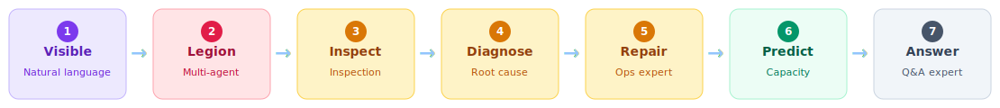

<div align="center">

<p align="center">
  
  &nbsp;&nbsp;
  
</p>

<h3>Open Source · AI-Native OpenTelemetry APM</h3>

<p><strong>Ask one question in plain English — AI agents query metrics, traces, and topology together, then tell you what broke.</strong></p>

<p align="center">
  <a href="https://demo.databuff.ai">Live Demo</a>
  &nbsp;|&nbsp;
  <a href="docs/README_en.md">Documentation</a>
  &nbsp;|&nbsp;
  <a href="README.md">中文</a>
  &nbsp;|&nbsp;
  <a href="#community">Community</a>
</p>
<p align="center">
  Username:Admin, Password:Databuff@123
</p>

</div>

<br/>

<p align="center">
  
</p>
<p align="center"><sub>AI multi-agent troubleshooting · Service health · Call graph topology — English UI</sub></p>

<br/>

<p align="center">
  
</p>

---

<h2>Features</h2>

- 🤖 **AI-native, not a bolt-on chat box** — LLM queries traces, metrics, topology, and alerts directly from real data
- 🧠 **Multi-agent collaboration** — AI Brain orchestrates query, inspection, ops, and Q&A experts; complex tasks run in parallel
- 🎯 **AI application observability** (Roadmap) — LLM call chains · token analytics · agent topology · skill/tool/model tracing
- ⚡ **eBPF APM** (Roadmap) — kernel-level, non-intrusive collection without code changes
- 📊 **Dual-protocol APM foundation** — OTLP native ingestion + **SkyWalking native gRPC compatibility**; existing SkyWalking users can switch by changing the exporter address
- 🚨 **Alerting loop** — threshold and change detection, scheduled evaluation, alert event history
- 🔧 **Skill + Tool extensibility** — override built-in skills, add custom digital experts without touching core code
- 🔌 **MCP both ways** — expose platform capabilities to Cursor / Claude; ingest external MCPs (Prometheus, etc.)
- 🐳 **Minimal 3-component stack** — Ingest + Doris + Web; one Docker / K8s command, no middleware sprawl
- 🌐 **Bring your own model** — OpenAI-compatible + Anthropic Messages; Kimi, DeepSeek, GLM, Bailian, Qianfan, Ollama, and more

---

<p align="center" id="aiops-roadmap" style="font-size:18px;font-weight:700;margin:8px 0;">AIOps Roadmap: Visible → Legion → Inspect → Diagnose → Repair → Predict → Answer</p>

<p align="center">Read the roadmap first, then expand each step. The full arc is the closed loop of AIOps — from "can see" to "can act" to "can accompany".</p>

<p align="center"></p>

---

<h2 align="center" id="seven-capabilities">Seven Capabilities Expanded</h2>

<p align="center"><strong>① Visible · Natural language query</strong></p>
<p align="center">Ask "which service was slowest in the last hour" in plain English — AI queries 20 services itself, returns the top 3 with average latency. No query language to learn.</p>
<p align="center">
  
</p>

<p align="center"><strong>② Legion · Multi-agent parallel dispatch</strong></p>
<p align="center">Don't pick a specific expert — hand the complex task to the AI Brain. It dispatches to the query + inspection experts in parallel, then synthesizes a forwardable incident report.</p>
<p align="center">
  
</p>

---

<p align="center"><strong>③ Inspect · Inspection + HTML report</strong></p>
<p align="center">One sentence triggers a single-service inspection. 81 seconds later, a fully formatted HTML report appears: entry health 98, downstream MySQL 60, Redis 100, active alerts 0 — the entry looks perfectly healthy, yet the error log section surfaces 60 <code>InsufficientStockException</code> errors in 30 minutes, hidden behind HTTP 200. Preview and forward directly.</p>
<p align="center">
  
</p>

<p align="center"><strong>④ Diagnose · Root cause analysis with evidence chain</strong></p>
<p align="center">Ask "is the bottleneck in the app, the database, or downstream?" — AI pulls topology, ranks outbound call metrics, attributes by share. Bottleneck is downstream service-b at 73.2%; other components are cleared. The conclusion is ready to paste into an incident report.</p>
<p align="center">
  
</p>

<p align="center"><strong>⑤ Repair · Ops expert SSHes in and acts</strong></p>
<p align="center">Beyond reading dashboards, it can log into the machine and fix things. Container stuck in a restart loop? The ops expert SSHes in, runs docker logs / inspect / free -m, identifies OOM 137 — the container memory limit was only 10MB while the JVM needed 64MB. It removes the old container, recreates it with 512MB, and docker ps is stable again. The watershed from "can see" to "can repair".</p>
<p align="center">
  
</p>

---

<p align="center"><strong>⑥ Predict · Capacity health analysis</strong></p>
<p align="center">From "post-incident firefighting" to "pre-incident prediction". AI clarifies the real dependency graph, then judges the high-latency Redis — 98 QPS is far below single-node 10k capacity, so the bottleneck is not capacity but big keys / slow commands. Clear advice: don't blindly scale up.</p>
<p align="center">
  
</p>

<p align="center"><strong>⑦ Answer · Open-source product with a built-in concierge</strong></p>
<p align="center">"How do I integrate the OTel SDK? Where do I configure alert thresholds?" The Q&A expert actually reads the product docs and returns OTLP ports (gRPC 4317 / HTTP 4318), the Spring Boot Java Agent one-liner for zero-code instrumentation, and the alert config menu path — its own docs, more reliable than a search engine.</p>
<p align="center">
  
</p>

---

<h2 align="center" id="data-ingestion">Data Ingestion: Dual-Protocol Native Compatibility</h2>

<p align="center">DataBuff supports both OpenTelemetry and SkyWalking native ingestion — existing agents switch over without rework.</p>

<table align="center" cellpadding="0" cellspacing="0" style="border-collapse:collapse;max-width:760px;">
<tr>
<th align="left" style="background:#f1f5f9;border:1px solid #cbd5e1;padding:10px 14px;font-size:14px;width:160px;">Protocol</th>
<th align="left" style="background:#f1f5f9;border:1px solid #cbd5e1;padding:10px 14px;font-size:14px;width:200px;">Port / Endpoint</th>
<th align="left" style="background:#f1f5f9;border:1px solid #cbd5e1;padding:10px 14px;font-size:14px;">Supported signals</th>
</tr>
<tr>
<td style="border:1px solid #cbd5e1;padding:10px 14px;font-size:13px;"><b>OTLP</b> (OpenTelemetry native)</td>
<td style="border:1px solid #cbd5e1;padding:10px 14px;font-size:13px;">gRPC <code>4317</code> · HTTP <code>4318</code></td>
<td style="border:1px solid #cbd5e1;padding:10px 14px;font-size:13px;">Traces + Metrics + Logs</td>
</tr>
<tr>
<td style="border:1px solid #cbd5e1;padding:10px 14px;font-size:13px;"><b>SkyWalking</b> native gRPC</td>
<td style="border:1px solid #cbd5e1;padding:10px 14px;font-size:13px;">gRPC <code>11800</code></td>
<td style="border:1px solid #cbd5e1;padding:10px 14px;font-size:13px;">Trace Segment + JVM metrics + Logs (reuse existing SW Agent, just change exporter address)</td>
</tr>
</table>

---

<h2 align="center" id="screenshots">Screenshots · The UI itself is a capable APM</h2>

<p align="center">AI reads the data for you; the UI confirms what the AI said. Two legs walking. Global topology, service list, service detail, service flow — every viewpoint is there, drill down from the topology to a single trace.</p>

<table border="0" cellspacing="12" cellpadding="0" align="center">
<tr>
<td align="center" width="450">
  
  <br/><sub>Service list · Traffic-light status for anomalies</sub>
</td>
<td align="center" width="450">
  
  <br/><sub>Global topology · Auto-generated call graph</sub>
</td>
</tr>
<tr>
<td align="center" width="450">
  
  <br/><sub>Service detail · Metric trends and instances</sub>
</td>
<td align="center" width="450">
  
  <br/><sub>Service flow · Upstream and downstream dependencies</sub>
</td>
</tr>
</table>

---

<h2 align="center">Architecture</h2>

<p align="center">
  
</p>

---

<h2 align="center" id="installation">Quick Start</h2>

> ⚡ From running the install command to demo apps reporting data and showing traces and topology, you can see results in about **5 minutes**.

<p align="center">
  
</p>

Requires **docker** and **docker-compose**. The install script auto-detects amd64/arm64 and downloads the matching image bundle.

**1. Install Platform**

```bash
curl -fsSL https://databuff.ai/databuff/ai-apm-install.sh | bash
```

**2. Install Demo App** (optional)

```bash
curl -fsSL https://databuff.ai/databuff/ai-apm-demo-install.sh | bash
```

<details>
<summary><b>Offline Install</b></summary>

When the registry is unreachable, download the bundle for your architecture and install on the target machine. Pick a version on the [install page](https://databuff.ai/#install) under **Docker → Offline Install**, or use:

`https://openocta.com/pkg/databuff/<version>/offline/databuff-ai-apm-offline-<version>-<arch>.tar.gz`

```bash
tar -zxvf databuff-ai-apm-offline-<version>-<arch>.tar.gz
cd databuff-ai-apm-offline-<version>-<arch>

# Install platform
sudo ./install.sh
```

</details>

<details>
<summary><b>Kubernetes</b></summary>

Requires **kubectl** and a working Kubernetes cluster. The script installs the platform via K8s manifests.

**1. Install Platform**

```bash
curl -fsSL https://databuff.ai/databuff/ai-apm-k8s-install.sh | bash
```

**2. Install Demo App** (optional)

```bash
curl -fsSL https://databuff.ai/databuff/ai-apm-demo-k8s-install.sh | bash
```

**Offline image download**

If the install commands above cannot pull images due to network issues, run the following to download an offline image bundle and load it onto the node.

```bash
curl -fsSL https://databuff.ai/databuff/ai-apm-k8s-download-images.sh | bash
```

</details>

<p align="center">
  Open <code>http://YOUR_HOST:27403</code> · Default login <code>admin</code> / <code>Databuff@123</code> · Add your API key in model settings to enable AI
  <br/>
</p>

---

<h2 align="center" id="community">Community & Contributing</h2>

<p align="center">
  <a href="CONTRIBUTING.md">Contributing Guide</a>
  &nbsp;·&nbsp;
  <a href="https://github.com/databufflabs/databuff/issues">Open Issues</a>
  &nbsp;·&nbsp;
  <a href="https://github.com/databufflabs/databuff/discussions">Discussions</a>
  &nbsp;·&nbsp;
  <a href="https://github.com/databufflabs/databuff/labels/good%20first%20issue">Good First Issues</a>
</p>

<p align="center">
  See <a href="CONTRIBUTING.md">CONTRIBUTING.md</a> to learn how to submit PRs, report bugs, or request features.
  <br/>
  Join our WeChat community for real-time help 👇
</p>

<p align="center">
  
</p>

<br/>


