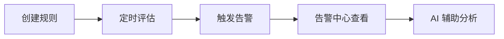

  <a href="告警.md">中文</a>
  &nbsp;|&nbsp;
  <a href="告警_en.md">English</a>

# 使用手册 · 告警

指标异常时自动记录事件并触发告警。

---

## 能力概览

| 能力 | 说明 |
|------|------|
| **阈值告警** | 错误率、延迟、吞吐等指标超线触发 |
| **突变检测** | 捕捉指标的突然变化 |
| **定时评估** | 每分钟自动检查，回看最近 5 分钟数据 |
| **事件记录** | 记录触发、恢复、处理状态（指标恢复后自动标记已解决） |
| **AI 分析** | 告警详情内可直接追问根因 |

评估机制详见 [架构设计 · 告警](../架构设计/告警.md)。

---

## 菜单入口

| 功能 | 路径 |
|------|------|
| 检测规则 | 配置管理 → 告警配置 → 检测规则 |
| 推荐规则 | 检测规则页 → 推荐规则（一键复制预置模板） |
| 收敛策略 | 配置管理 → 告警配置 → 收敛策略 |
| 静默计划 | 配置管理 → 告警配置 → 静默计划 |
| 告警列表 | 告警中心 → 告警列表 |
| 问题列表 | 告警中心 → 问题列表（收敛后的故障视图） |

> 外部通知（Webhook、邮件等）尚未支持，见 [Roadmap](../Roadmap.md)「告警更强 → 通知集成」。

---

## 使用流程

### 1. 创建检测规则

**配置管理 → 告警配置 → 检测规则 → 新建规则**

或从 **推荐规则** 复制预置模板后微调。

可配置项：

- **监控对象**：服务或实例范围
- **指标**：错误率、平均延迟、P99 延迟、请求量等
- **条件**：阈值（大于/小于）或突变检测
- **级别**：提示 / 警告 / 严重
- **评估周期**：跟随平台默认定时任务（每分钟）

### 2. 查看与处理告警

**告警中心 → 告警列表**

按服务、级别、状态筛选。点击告警进入详情，可查看：

- 异常指标趋势
- 关联 Trace 与日志
- （可选）AI 根因分析，或 **告警中心 → 手动根因分析** 指定时间范围排查
- 处理日志

指标恢复后告警自动标记为已解决。

### 3. 告警列表 vs 问题列表

- **告警列表**：单条规则触发的原始事件，适合逐条处理
- **问题列表**：经收敛策略合并后的故障视图，适合看影响面与恢复效率

### 4. 告警配置（进阶）

| 配置项 | 作用 |
|--------|------|
| **收敛策略** | 同类告警合并，减少列表噪音 |
| **静默计划** | 维护窗口内暂停告警评估 |

---

## 与 AI 协同

告警详情页或 AI 平台可直接问：

> 「order-service 错误率告警，帮我分析原因」

AI 会查指标、Trace、拓扑并给出诊断。Agent 集成场景下可通过 MCP 工具 `queryServiceAlarms` 查询告警，详见 [Agent 集成](Agent集成.md)。

---

## 常见问题

| 现象 | 处理 |
|------|------|
| 规则创建后无告警 | 确认服务已有指标；评估每分钟执行；检查监控对象是否匹配（见 [Docker](../运维参考/Docker运维.md#常见故障) / [K8s](../运维参考/K8s运维.md#常见故障) 运维排障） |
| Demo 装完看不到告警 | 先在推荐规则中手动开启规则，装 Demo 产生流量后等待 1–2 个评估周期 |
| 告警过多 | 调整阈值；配置收敛策略或静默计划 |
