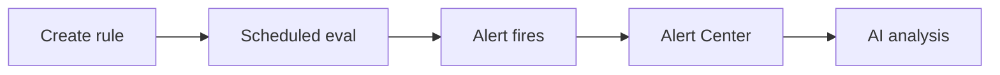

  <a href="告警.md">中文</a>
  &nbsp;|&nbsp;
  <a href="告警_en.md">English</a>

# User Guide · Alerting

Automatically record and fire alerts when metrics go wrong.

---

## Capabilities

| Capability | Description |
|------------|-------------|
| **Threshold alerts** | Fire when error rate, latency, throughput, etc. cross the line |
| **Change detection** | Catch sudden metric shifts |
| **Scheduled evaluation** | Runs every minute, looking back 5 minutes |
| **Event records** | Track trigger, recovery, handling (auto-resolved when metrics recover) |
| **AI analysis** | Ask for root cause directly from alert details |

Evaluation mechanics: [Architecture · Alerting](../架构设计/告警_en.md).

---

## Menu Paths

| Feature | Path |
|---------|------|
| Detection rules | Configuration → Alert Config → Detection Rules |
| Preset rules | Detection Rules → Preset Rules (one-click copy) |
| Convergence policy | Configuration → Alert Config → Convergence |
| Silence schedule | Configuration → Alert Config → Silence |
| Alert list | Alert Center → Alert List |
| Problem list | Alert Center → Problems (converged incident view) |

> External notifications (Webhook, email, etc.) are not supported yet. See [Roadmap](../Roadmap_en.md) — *Stronger alerting → notification integrations*.

---

## Workflow

### 1. Create a Detection Rule

**Configuration → Alert Config → Detection Rules → New Rule**

Or copy a template from **Preset Rules** and adjust.

Configurable fields:

- **Scope**: service or instance
- **Metrics**: error rate, avg latency, P99 latency, request count, etc.
- **Condition**: threshold (above/below) or change detection
- **Severity**: Info / Warning / Critical
- **Evaluation**: follows platform default (every minute)

### 2. View and Handle Alerts

**Alert Center → Alert List**

Filter by service, severity, status. Click an alert for details:

- Abnormal metric trends
- Related traces and logs
- (Optional) AI root cause analysis, or **Alert Center → Manual Root Cause Analysis** for a time-range investigation
- Handling log

Alerts auto-resolve when metrics recover.

### 3. Alert List vs Problem List

- **Alert List**: individual rule-triggered events — handle one by one
- **Problem List**: converged incident view — see blast radius and recovery efficiency

### 4. Advanced Config

| Setting | Purpose |
|---------|---------|
| **Convergence** | Merge similar alerts to reduce list noise |
| **Silence** | Suppress alert evaluation during maintenance windows |

---

## Working with AI

From alert details or AI Platform:

> "order-service error rate alert — help me analyze the cause"

AI queries metrics, traces, and topology automatically. For Agent integration, use MCP tool `queryServiceAlarms` — see [Agent Integration](Agent集成_en.md).

---

## FAQ

| Symptom | Action |
|---------|--------|
| No alerts after creating rules | Ensure services have metrics; evaluation runs every minute; verify rule scope (see [Docker](../运维参考/Docker运维_en.md#common-issues) / [K8s](../运维参考/K8s运维_en.md#common-issues) ops troubleshooting) |
| No alerts after Demo install | Manually enable a rule in Preset Rules first; install demo app for traffic; wait 1–2 evaluation cycles |
| Too many alerts | Tune thresholds; add convergence or silence policies |
