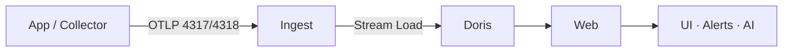

  <a href="遥测数据流.md">中文</a>
  &nbsp;|&nbsp;
  <a href="遥测数据流_en.md">English</a>

# Telemetry Pipeline and Storage

> Read this overview first, then dive into [Application Performance](应用性能_en.md), [Log Analytics](日志分析_en.md), and other module designs.

DataBuff ingests telemetry via **OpenTelemetry OTLP**, writes through **Ingest** into **Apache Doris**, and serves queries, topology, alerting, and AI diagnostics from **Web**.

## Overview

## Three Signals

| Signal | Typical source | Ingest processing | Doris tables (examples) | Web capabilities |
|--------|----------------|-------------------|-------------------------|------------------|
| **Trace** | OTel SDK, Java Agent | Span assembly, service metadata | `trace_dc_span` | Traces, topology, flame graphs |
| **Metrics** | OTel metrics, JVM/HTTP, etc. | Minute-level aggregation | `metric_service*`, etc. | Service metrics, dashboards |
| **Logs** | OTel logs exporter | OTLP log record parsing | `log_dc_record` | Log search, trace correlation |

See [OpenTelemetry OTLP Ingestion](../opentelemetry-otlp-ingestion_en.md) for exporter setup.

## How Trace, Metrics, and Logs Relate

- **Trace ↔ Logs**: Log records may carry `trace_id` / `span_id` (OTel conventions); trace detail views can show related log lines.
- **Trace ↔ Metrics**: Ingest derives minute-level service and endpoint metrics from spans, sharing `service` / `instance` dimensions with traces.
- **Unified query surface**: Web aggregates all three by service and time range; AI diagnostics use traces and metrics as context, with logs expanding over time.

## Component Roles

| Component | Role |
|-----------|------|
| **Ingest** | OTLP ingress, trace processing, metric aggregation, Doris Stream Load |
| **Doris** | Columnar storage and time-series queries; trace, log, and metric tables use daily partitions (~30-day retention by default) |
| **Web** | REST APIs, UI, alerting, AI platform and MCP |

Default Docker stack: Doris FE/BE, ingest, web. See [Docker Operations Reference](../运维参考/Docker运维_en.md).

## Further Reading

- [Architecture · Application Performance](应用性能_en.md)
- [Architecture · Log Analytics](日志分析_en.md)
- [Architecture · AI Platform](AI平台_en.md)
