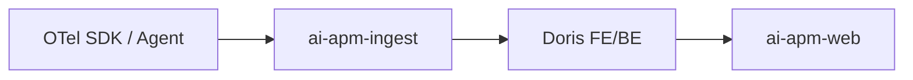
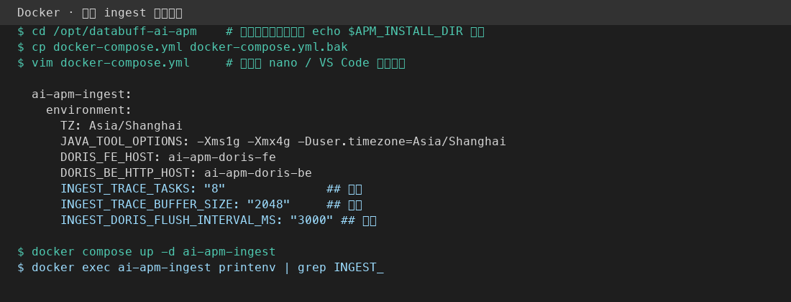
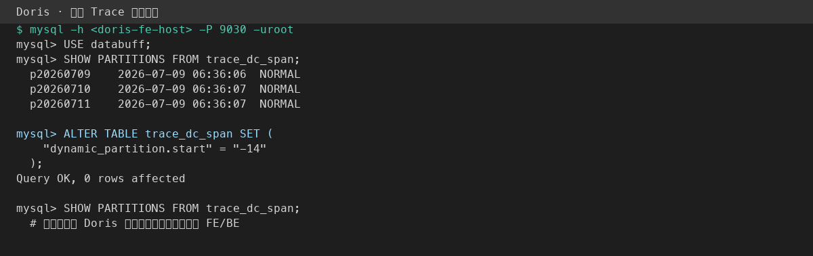
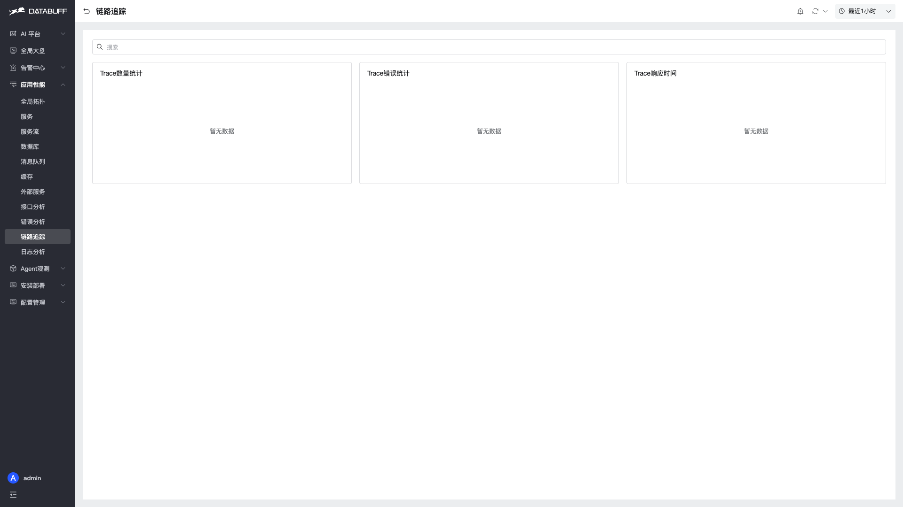
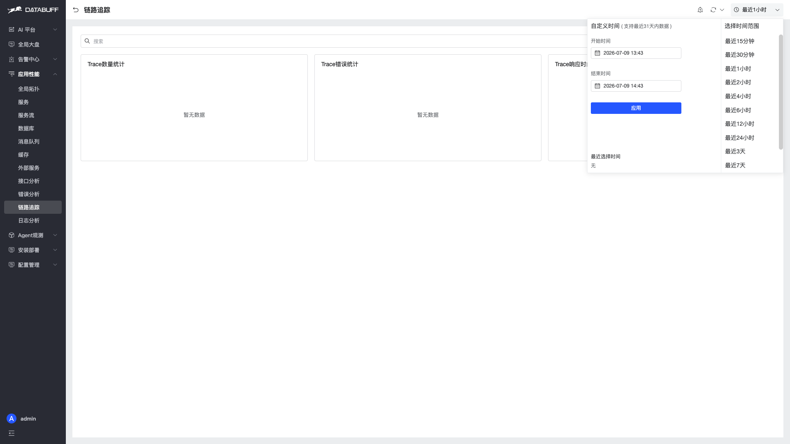
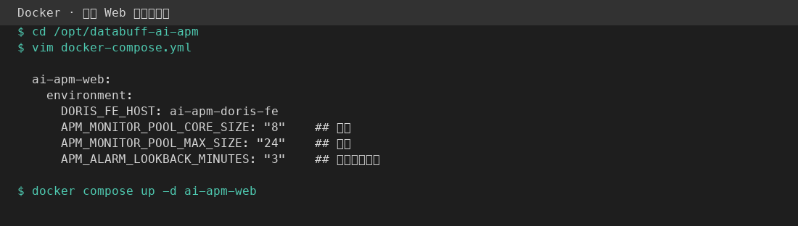
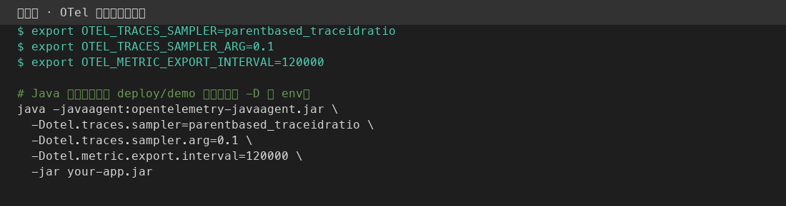
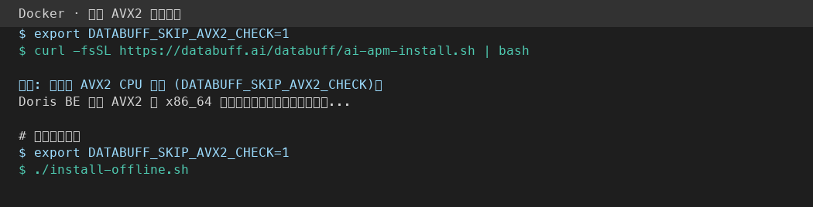

<p align="center">
  <a href="性能优化.md">中文</a>
  &nbsp;|&nbsp;
  <a href="性能优化_en.md">English</a>
</p>

# Performance Tuning and Capacity Planning

This guide covers **Docker one-line install** resource baselines, ingest pipeline and Doris storage tuning, web query settings, and agent/SDK volume reduction. Install paths and ports: [Docker Operations](Docker运维_en.md).

## 1. Capacity Overview

### Default architecture

Docker runs **four containers** (Doris FE + BE, ingest, web). Telemetry enters via OTLP, batches into Doris, and is queried by the web platform. See [Telemetry Pipeline and Storage](../架构设计/遥测数据流_en.md).



### Host resource guidance

Limits below come from `deploy/docker/docker-compose.yml` (installed copy at `/opt/databuff-ai-apm/docker-compose.yml`).

| Tier | CPU (cores) | Memory | Notes |
|------|-------------|--------|-------|
| **Minimum viable** | ≥ 6 | ≥ 16 GiB | Container limits total ~6 CPU / 15 GiB; leave headroom for the OS and page cache |
| **Production starter** | ≥ 8 | ≥ 32 GiB | Moderate telemetry at default 30-day retention; BE is the main storage/compaction consumer |
| **High load** | Scale with telemetry growth | Prefer more BE memory and disk | Tune agent sampling and retention before ingest/BE |

| Component | CPU limit | Memory limit | JVM / notes |
|-----------|-----------|--------------|-------------|
| Doris FE | 1 | 2 GiB | Startup script patches FE `-Xmx` to **1200m** (default 8192m OOMs in a 2g container) |
| Doris BE | 2 | 6 GiB | Column storage, compaction, Stream Load |
| ingest | 2 | 5 GiB | `JAVA_TOOL_OPTIONS`: `-Xms1g -Xmx4g` |
| web | 1 | 2 GiB | `JAVA_TOOL_OPTIONS`: `-Xms512m -Xmx1536m` |

> **OOM**: Unpatched FE or undersized BE memory can get containers killed. See [Docker Operations — Common issues](Docker运维_en.md#common-issues).

### Telemetry volume estimation (methodology)

Use these for **planning**, not as benchmark results. Plug in your own sampling rates and payload sizes.

| Signal | Inputs | Rough relationship |
|--------|--------|-------------------|
| Trace | `S` = spans/s, `R` = retention days | Daily rows ≈ `S × 86400`; disk scales with span width and `meta` size |
| Metrics | `M` = Doris metric rows/min (incl. minute rollups) | Daily rows ≈ `M × 1440`; many `metric_*` tables amplify per-service cardinality |
| Logs | `L` = log records/min | Daily rows ≈ `L × 1440`; `body` and `attributes` dominate row size |

**Disk growth**: `daily_increment × R × compression_ratio`. Doris columnar compression varies by data; observe `data/be-storage` (Docker) or the BE volume for **7 days** before extrapolating. Shortening retention via `dynamic_partition.start` is often more effective than adding disk alone.

## 2. Ingest pipeline tuning

Ingest uses LMAX Disruptor ring buffers and worker pools. Defaults are in `ai-apm-ingest/src/main/resources/application.yml`.

### Parallelism and buffers

| YAML key | Environment variable | Default | When to tune | Increase | Decrease |
|----------|---------------------|---------|--------------|----------|----------|
| `ingest.pipeline.trace-tasks` | `INGEST_TRACE_TASKS` | `4` | Trace parse/assemble workers | More CPU, less per-queue backlog | Less parallelism, lower CPU |
| `ingest.pipeline.metric-tasks` | `INGEST_METRIC_TASKS` | `4` | OTLP/JVM/minute metric routing | Same | Same |
| `ingest.pipeline.aggregate-tasks` | `INGEST_AGGREGATE_TASKS` | `4` | Minute aggregation workers | Try first under high metric throughput | Save resources at low load |
| `ingest.pipeline.trace-buffer-size` | `INGEST_TRACE_BUFFER_SIZE` | `1024` | Ring slots per trace worker (min 16) | Absorb bursts, more memory | Overflow drops events sooner |
| `ingest.pipeline.metric-buffer-size` | `INGEST_METRIC_BUFFER_SIZE` | `1024` | Ring slots per metric worker | Same | Same |
| `ingest.pipeline.aggregate-buffer-size` | `INGEST_AGGREGATE_BUFFER_SIZE` | `1024` | Ring slots per aggregate worker | Same | Same |

When the ring is full, `AsyncTask` increments `overflowCount` after failed `tryPublish` attempts and drops the event. If logs look healthy but the UI misses data, raise `*_BUFFER_SIZE` or `*_TASKS` first.

### How to change ingest settings (Docker)

For the one-line install layout (default directory `/opt/databuff-ai-apm`; confirm with `echo $APM_INSTALL_DIR`).

1. **Back up and edit compose**

```bash
cd /opt/databuff-ai-apm
cp docker-compose.yml docker-compose.yml.bak
vim docker-compose.yml   # or nano / VS Code Remote
```

2. **Under `ai-apm-ingest` → `environment`, add** (keep existing `DORIS_*`, `JAVA_TOOL_OPTIONS`, etc.):

```yaml
  ai-apm-ingest:
    environment:
      # ... existing keys ...
      INGEST_TRACE_TASKS: "8"
      INGEST_TRACE_BUFFER_SIZE: "2048"
      INGEST_DORIS_FLUSH_INTERVAL_MS: "3000"
```



3. **Apply and verify**

```bash
docker compose up -d ai-apm-ingest
docker exec ai-apm-ingest printenv | grep '^INGEST_'
```

You should see `INGEST_TRACE_TASKS=8`, etc. If not, check YAML indentation under `environment:`.

4. **Watch impact**: `docker compose logs -f ai-apm-ingest` for Stream Load timeouts; compare trace visibility latency in the UI.

> **Tuning order**: Fix drops with `INGEST_*_BUFFER_SIZE` / `*_TASKS` first, then tune `INGEST_DORIS_FLUSH_INTERVAL_MS`. Change one or two knobs at a time so you can roll back via `.bak`.

### Doris flush and trace assembly

| YAML key | Environment variable (Spring binding) | Default | Meaning | Increase | Decrease |
|----------|--------------------------------------|---------|---------|----------|----------|
| `ingest.doris.flush-interval-ms` | `INGEST_DORIS_FLUSH_INTERVAL_MS` | `5000` | Scheduled flush interval (`DorisFlushScheduler`) | Larger batches, higher write latency | More frequent flushes, lower latency, more Doris load |
| `ingest.doris.flush-timeout-ms` | `INGEST_DORIS_FLUSH_TIMEOUT_MS` | `45000` | Stream Load wait cap (min 5000) | Tolerate slow BE / large batches | Fail faster on timeouts |
| `ingest.trace.assembly-check-interval-ms` | `INGEST_TRACE_ASSEMBLY_CHECK_INTERVAL_MS` | `2000` | Incomplete trace scan period | Less CPU scanning, longer partial traces | Faster cross-span assembly |
| `ingest.metric.trace-minute-late-flush-grace-ms` | `INGEST_METRIC_TRACE_MINUTE_LATE_FLUSH_GRACE_MS` | `20000` | Grace for late traces before minute flush | Tolerate clock skew / slow traces | Earlier minute buckets, weaker late-span linkage |

Set `INGEST_DORIS_*` and related keys under `ai-apm-ingest` → `environment`, then `docker compose up -d ai-apm-ingest`.

## 3. Doris storage and retention

Schema: `deploy/common/sql/databuff.sql`. Trace, log, and most `metric_*` tables use **daily dynamic partitions**.

### Default retention

```sql
"dynamic_partition.enable" = "true",
"dynamic_partition.time_unit" = "DAY",
"dynamic_partition.start" = "-30",
"dynamic_partition.end" = "3",
"dynamic_partition.prefix" = "p"
```

| Property | Meaning |
|----------|---------|
| `dynamic_partition.start = -30` | Keep roughly **30 historical day partitions** (older partitions are dropped automatically) |
| `dynamic_partition.end = 3` | Pre-create **3 future days** |
| `dynamic_partition.time_unit = DAY` | Daily roll |

### Changing retention

On a **running** cluster, use Doris MySQL protocol (FE port **9030**) — **no FE/BE restart** required.

**Steps:**

1. Connect from a host that can reach Doris FE:

```bash
mysql -h 127.0.0.1 -P 9030 -uroot
```

Without a local client: `docker run --rm -it mysql:8.4 mysql -h <fe-host> -P 9030 -uroot`

2. Inspect trace partitions:

```sql
USE databuff;
SHOW PARTITIONS FROM trace_dc_span;
```

3. Shorten retention from 30 days to **14 days** (example):

```sql
ALTER TABLE trace_dc_span SET (
  "dynamic_partition.start" = "-14"
);
```

4. Repeat for logs and metrics as needed:

```sql
ALTER TABLE log_dc_record SET ("dynamic_partition.start" = "-14");
ALTER TABLE metric_service SET ("dynamic_partition.start" = "-14");
```

5. Run `SHOW PARTITIONS` again; partitions outside the new window are **removed on Doris schedule**, not instantly.



**Greenfield**: edit `dynamic_partition.start` in `deploy/common/sql/databuff.sql` before the first `start.sh` import.

> Shorter retention quickly reduces BE disk and compaction pressure; longer retention needs disk and memory planning.

### Query performance

- Trace/log tables are partitioned on `startTime` / `log_time`: **always filter by time** to avoid scanning many days.
- Trace table `DISTRIBUTED BY HASH(trace_id)`: point lookups by `trace_id` are friendly; wide aggregates still need partition pruning.
- **Web UI**: use the time picker (default **Last 1 hour**). For single-incident triage, pick **Last 15 minutes** to **1 hour**; use 6h/1d only for trends.

**How to narrow the time window:**

1. Open **Application Performance → Trace Tracking** (or Services / Log Analytics).
2. Click **Last 1 hour** (or the current range label) in the top-right.
3. Choose a preset (e.g. **Last 15 minutes**) or set start/end, then **Apply**.





### FE / BE memory

- **FE**: `docker-compose.yml` startup `sed`-patches `-Xmx8192m` → `-Xmx1200m`. **Do not remove** this patch.
- **BE OOM**: Docker deploy does not set container `mem_limit`; BE uses host free RAM. Keep ≥6–8g free on the host and watch usage with `docker stats ai-apm-doris-be --no-stream`.

If OOM persists, shorten `dynamic_partition.start` or add disk before adding host memory.

## 4. Web queries and alerting

Settings: `ai-apm-web/src/main/resources/application.yml`.

### Monitor task pool

| YAML key | Environment variable | Default | Role | Increase | Decrease |
|----------|---------------------|---------|------|----------|----------|
| `apm.monitor.pool.core-size` | `APM_MONITOR_POOL_CORE_SIZE` | `4` | Steady alarm/monitor workers | Evaluate more rules in parallel | Less CPU; rules may queue |
| `apm.monitor.pool.max-size` | `APM_MONITOR_POOL_MAX_SIZE` | `16` | Peak worker cap | Higher burst throughput | Cap concurrency to protect Doris |
| `apm.monitor.pool.queue-size` | `APM_MONITOR_POOL_QUEUE_SIZE` | `100` | Pending task queue | Buffer evaluation spikes | Tasks rejected when full |

Implemented in `MonitorTaskPool.java`.

### Alarm scheduling

| YAML key | Environment variable | Default | Meaning |
|----------|---------------------|---------|---------|
| `apm.alarm.lookback-minutes` | `APM_ALARM_LOOKBACK_MINUTES` | `5` | Minutes of data per rule evaluation |
| `apm.alarm.evaluation-cron` | `APM_ALARM_EVALUATION_CRON` | `0 * * * * ?` | Fire at second 0 every minute (Spring 6-field cron) |

Under Doris pressure, prefer fewer/narrower rules over raising lookback — a longer window loads more data per evaluation.

### HTTP compression

`server.compression.enabled: true` gzip-responses for JSON/JS/etc. above 1024 bytes. Usually leave enabled for dashboards and topology APIs.

### How to change the web monitor pool (Docker)

Alarm evaluation uses `apm.monitor.pool.*`. Override via **web container env** in `docker-compose.yml` → `ai-apm-web.environment`.

1. Edit `/opt/databuff-ai-apm/docker-compose.yml` and add:

```yaml
      APM_MONITOR_POOL_CORE_SIZE: "8"
      APM_MONITOR_POOL_MAX_SIZE: "24"
      APM_ALARM_LOOKBACK_MINUTES: "3"   # optional, default 5
```

2. `docker compose up -d ai-apm-web`



> With many rules, **fewer rules** beats unbounded pool growth; higher `lookback-minutes` increases Doris scan size per run.

## 5. OTel SDK / agent recommendations

Reduce **ingress volume** before server tuning. Baseline: [OpenTelemetry OTLP Ingestion](../opentelemetry-otlp-ingestion_en.md).

| Technique | Typical env / config | Effect |
|-----------|---------------------|--------|
| Head sampling | `OTEL_TRACES_SAMPLER=parentbased_traceidratio`, `OTEL_TRACES_SAMPLER_ARG=0.1` | Drops most traces at the SDK |
| Tail sampling | Collector `tail_sampling` processor | Keeps errors/slow traces; requires a Collector hop |
| Metric export interval | `OTEL_METRIC_EXPORT_INTERVAL` (SDK default often 60000 ms) | Lowers metric rows/min |
| Trace batching | `OTEL_BSP_MAX_EXPORT_BATCH_SIZE`, `OTEL_BSP_SCHEDULE_DELAY` | Network batching only; does not reduce stored rows |
| Log batching | `OTEL_BLRP_MAX_EXPORT_BATCH_SIZE`, `OTEL_BLRP_SCHEDULE_DELAY` | Controls log export batches and timing |

Recommended order: **sampling → metric interval → ingest/Doris**.

### How to configure OTel sampling (application)

Set env vars on the **business process** or demo startup script (OTel SDK reads them automatically):

```bash
export OTEL_TRACES_SAMPLER=parentbased_traceidratio
export OTEL_TRACES_SAMPLER_ARG=0.1
export OTEL_METRIC_EXPORT_INTERVAL=120000
java -javaagent:opentelemetry-javaagent.jar -jar your-app.jar
```

Java system properties also work: `-Dotel.traces.sampler=parentbased_traceidratio -Dotel.traces.sampler.arg=0.1`



Restart the app, then check trace volume under **Application Performance → Trace Tracking**. See [OpenTelemetry OTLP Ingestion](../opentelemetry-otlp-ingestion_en.md).

## 6. Offline vs online install

Same images and `docker-compose.yml` defaults — **no performance difference**; only distribution differs ([Offline Installation](离线安装_en.md)). Tune performance in the install directory `docker-compose.yml` as in the ingest / web / BE sections above.

## 7. Bypass AVX2 check on x86_64 without AVX2

Doris BE on **x86_64 / amd64** uses **AVX2** for vectorized queries. Online/offline installers call `ensure_avx2_cpu` from `deploy/common/scripts/check-avx2.sh`. If `/proc/cpuinfo` lacks the `avx2` flag, install **exits 1**.

These cases **skip** the check automatically:

| Environment | Behavior |
|-------------|----------|
| **arm64 / aarch64** | Check skipped |
| **macOS (no `/proc/cpuinfo`)** | Check skipped (Doris in Linux containers still follows host CPU features) |

### Recommended: `DATABUFF_SKIP_AVX2_CHECK` (v0.1.2+ script)

Set before install:

**Online (curl):**

```bash
export DATABUFF_SKIP_AVX2_CHECK=1
curl -fsSL https://databuff.ai/databuff/ai-apm-install.sh | bash
```

**Offline:**

```bash
export DATABUFF_SKIP_AVX2_CHECK=1
cd /path/to/databuff-docker-offline-*-amd64
./install-offline.sh
```



A **warning** (not an error) is printed; Doris may be unstable without AVX2.

### Fallback: patch offline bundle script

For older `check-avx2.sh` without the env var:

1. Edit `scripts/check-avx2.sh` inside the extracted offline bundle
2. Add `return 0` as the first line of `ensure_avx2_cpu()` (or replace the function body with `return 0`)
3. Run `./install-offline.sh`

For curl install without an updated CDN script, use an offline bundle or wait for a release that ships the skip logic.

### Verify AVX2 after install

```bash
grep -m1 avx2 /proc/cpuinfo && echo "AVX2: yes" || echo "AVX2: no"
```

### Risks

| Topic | Notes |
|-------|-------|
| **Why we check** | Doris does not support non-AVX2 x86_64; BE may fail to start, run slowly, or crash |
| **What skip does** | Bypasses the **installer** only; does not change Doris binaries |
| **Recommendation** | Production: **Haswell+** x86_64 or **arm64**; skip only for PoC / legacy VMs |

## 8. Troubleshooting checklist

| Symptom | Checks | Mitigation |
|---------|--------|------------|
| High ingest write latency | `INGEST_*_BUFFER_SIZE`, `*_TASKS`; `INGEST_DORIS_FLUSH_INTERVAL_MS` / `FLUSH_TIMEOUT_MS` | Raise parallelism/buffers; shorter flush interval trades Doris load |
| Ingest write failures | `DORIS_FE_HOST`, `DORIS_BE_HTTP_HOST`; ingest/BE logs | Fix Stream Load connectivity; BE disk and health |
| Doris BE OOM / restart | Host free RAM, retention, `be-storage` usage | More host memory or shorter `dynamic_partition.start` |
| Doris FE OOM | FE `-Xmx1200m` patch present | Keep compose `sed` patch |
| Slow web queries | UI time range; partition pruning; BE compaction | Narrow time window; check BE CPU/IO |
| Rule evaluation slows web | `apm.monitor.pool.*`; rule count | Reduce rules; raise `max-size` if needed |
| Metrics but no traces | Agent sampling; ingest buffer overflow | Raise sampling or trace pipeline buffers |
| Install fails on AVX2 | `grep avx2 /proc/cpuinfo` | See [§7 Bypass AVX2](#7-bypass-avx2-check-on-x86_64-without-avx2); upgrade CPU or `DATABUFF_SKIP_AVX2_CHECK=1` |

Logs:

```bash
# Docker
docker compose logs -f ai-apm-ingest ai-apm-doris-be ai-apm-web
```

## Related docs

- [Docker Operations](Docker运维_en.md)
- [Telemetry Pipeline and Storage](../架构设计/遥测数据流_en.md)
- [OpenTelemetry OTLP Ingestion](../opentelemetry-otlp-ingestion_en.md)
